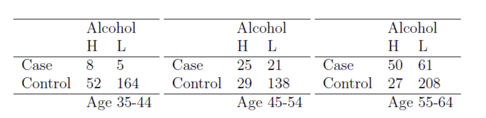
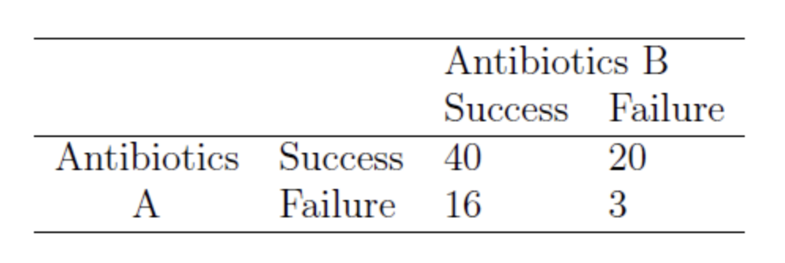
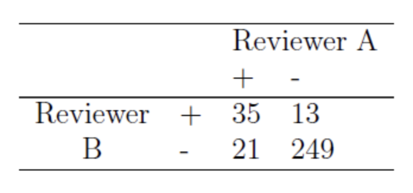

# Problem 1

FEV (forced expiratory volume) is an index of pulmonary function that measures the volume of air expelled after one second of constant effort. The data set `FEV.csv` (from e3 under "Homework 2") contains determinations of FEV in 1980 on 654 children age 3-19. The variables of `FEV.csv` are described as follows: 
 
| Variable | Meaning                  | Format or code         |
|:---------|:------------------------ |:---------------------- |
| ID       | ID number                |                        |
| age      | Age                      | years                  |
| FEV      | FEV in one second        | liters                 |
| height   | Height                   | inches                 |        
| sex      | Sex                      | 0=female; 1=male       |
| smoke    | Parental Smoking status  | 0=non-smoker; 1=smoker |
|          |                          |                        |

a.  (10 points) Suppose that we want to assess if the mean FEV is equal to 2.5 among boys with  ages 8-12 and heights 57-65. Perform a hypothesis testing. Please report the appropriate null and alternative hypotheses, the p-value and your conclusion in words. 


\(H_0\): \(\mu = 2.5\)（男孩此族群的平均 FEV 為 2.5）<br>
\(H_1\): \(\mu \neq 2.5\)（男孩此族群的平均 FEV 不等於 2.5）<br>


**檢定方法與解釋：**  
採用單一樣本 \(t\) 檢定。首先從資料中篩選出符合條件（性別為男、年齡介於 8 至 12 歲、身高介於 57 至 65 英吋）的子樣本，<br>
```{r}
# 讀取 FEV.csv 檔案
fev_data <- read.csv("FEV.csv")

# 篩選出性別為男、年齡介於 8 至 12 歲、身高介於 57 至 65 英吋的資料
filtered_data <- subset(fev_data, sex == "1" & age >= 8 & age <= 12 & height >= 57 & height <= 65)

# 檢視前幾筆篩選後的資料
head(filtered_data)


```

計算其樣本平均值 \(\bar{x}\) 與標準差 \(s\)。<br>
檢定統計量計算公式為：

\[
t = \frac{\bar{x} - 2.5}{s/\sqrt{n}}
\]

```{r}
# 計算樣本平均值、標準差與樣本數
x_bar <- mean(filtered_data$FEV)    # 樣本平均值
s <- sd(filtered_data$FEV)          # 樣本標準差
n <- length(filtered_data$FEV)      # 樣本數

cat("樣本平均值:", x_bar, "\n")
cat("樣本標準差:", s, "\n")
cat("樣本數:", n, "\n")

# 計算 t 統計量：$$t = \frac{\bar{x} - 2.5}{s/\sqrt{n}}$$
t_stat <- (x_bar - 2.5) / (s / sqrt(n))
cat("t 統計量:", t_stat, "\n")

# 進行單一樣本 t 檢定
t_test_result <- t.test(filtered_data$FEV, mu = 2.5)
print(t_test_result)
```

計算結果得到 \(t \approx -0.40\)，對應 degrees of freedom 125 的 \(p\)-value 為 0.6868。

**conclusion：**  
由於 \(p\)-value 大於 0.05，無法拒絕 \(H_0\): \(\mu = 2.5\)（男孩此族群的平均 FEV 為 2.5）; <br>因此，沒有足夠證據顯示該族群的平均 FEV 與 2.5 有顯著差異。


---


b.  (10 points) Suppose that we are also interested in comparing if boys and girls have the same FEV. Please perform a hypothesis testing to assess it, reporting the null and alternative hypotheses, the p-value and your conclusion in words. (Note: For the purpose of this exercise, assume equal variance where appropriate.) 

\(H_0: \mu_{\text{boys}} = \mu_{\text{girls}}\) 表示男孩與女孩的平均 FEV 相等。<br>
\(H_1: \mu_{\text{boys}} \neq \mu_{\text{girls}}\)表示男孩與女孩的平均 FEV 不相等。<br>

```{r}
# 讀取 FEV.csv 資料
fev_data <- read.csv("FEV.csv")

# 篩選符合條件的資料 (性別、年齡、身高)
boys_data <- subset(fev_data, sex == "1" & age >= 8 & age <= 12 & height >= 57 & height <= 65)
girls_data <- subset(fev_data, sex == "0" & age >= 8 & age <= 12 & height >= 57 & height <= 65)

# 進行雙尾兩獨立樣本 t 檢定（假設變異數相等）
t_test_result <- t.test(boys_data$FEV, girls_data$FEV, var.equal = TRUE)
print(t_test_result)

```

計算結果得到 \(t \approx -1.27\)，對應 degrees of freedom 289 的 \(p\)-value 為 0.2042。

**conclusion：**  
由於 \(p\)-value 大於 0.05，\(H_0: \mu_{\text{boys}} = \mu_{\text{girls}}\) 表示男孩與女孩的平均 FEV 相等; <br>因此，沒有足夠的證據支持男孩與女孩在 FEV 平均值上存在顯著差異。


c.  (10 points) Another aspect of the study involves looking if the data reflects the fact that a person’s pulmonary function declines with age. Suppose we test this hypothesis by looking at children ages 8-12 and heights 57-65 inches and measuring their FEV initially and then once again 2 years later. The FEV measurements in the data set `FEV.csv` are the baseline measurements. The data set `FEV2.csv` (from e3 under "Homework 2") contains two variables: the first variable is the ID number, and the second variable is the children’s FEV measurements 2 years later. What are the appropriate null and alternative hypotheses in this case? Perform a statistical analysis. Interpret in words.


\(H_0: \mu_{\text{baseline}} = \mu_{\text{2years}}\) 表示兩次測量的平均 FEV 相等。 <br>
\(H_1: \mu_{\text{baseline}} > \mu_{\text{2years}}\) 表示肺功能下降。 <br>

定義差異$d$為<br>

\( d = \mathrm{FEV}_{\text{baseline}} - \mathrm{FEV}_{\text{2years}} \)

\(H_0: \mu_{\text{d}} = 0\)  表示兩次測量的平均 FEV 相等。 <br>
\(H_1: \mu_{\text{d}} > 0\)  表示肺功能下降。 <br>


```{r}
# 讀取基線與兩年後的資料
fev_data <- read.csv("FEV.csv")
fev2_data <- read.csv("FEV2.csv")

# 以 ID 合併兩份資料
merged_data <- merge(fev_data, fev2_data, by = "ID")

# 進行成對樣本 t 檢定，檢定基線 FEV 是否大於兩年後的 FEV
# 假設 boys 與 girls 都符合條件，這裡以所有資料為例
t_test_result <- t.test(merged_data$FEV, merged_data$FEV2, paired = TRUE, alternative = "greater")
print(t_test_result)

```

計算結果得到 \(t \approx 1.88\)，對應 degrees of freedom:  653 的 \(p\)-value 為 0.03。

**conclusion：**  
由於 \(p\)-value 小於 0.05，拒絕\(H_0: \mu_{\text{d}} = 0\)  表示兩次測量的平均 FEV 相等。; <br> 因此，有足夠證據表明 baseline 的 FEV 顯著高於 2 年後的 FEV，支持孩子的肺功能隨著年齡增長而下降的說法。


d.  (10 points) Children having FEV measurements greater than 3 are seen as having perfect pulmonary function. Perform a hypothesis test to assess if the proportion of having perfect pulmonary function is equal to 0.25.

定義 $p$ 為擁有完美肺功能的孩子比例（即 FEV 測量值大於 3 的孩子比例）

\( H_0: P = 0.25 \)  表示擁有較好肺功能的人數占比等於 1/4。<br>
\( H_1: P \neq 0.25 \)  表示擁有較好肺功能的人數占比不等於 1/4。<br>


```{r}

fev_data <- read.csv("FEV.csv")

# 計算 FEV 大於 3 的孩子數量
perfect_count <- sum(fev_data$FEV > 3, na.rm = TRUE)

# 計算總樣本數
total_children <- nrow(fev_data)

# 顯示擁有完美肺功能（FEV > 3）的比例
proportion <- perfect_count / total_children
cat("擁有完美肺功能的比例:", proportion, "\n")

# 進行二項檢定
# 虛無假設: p = 0.25; 對立假設: p != 0.25
test_result <- binom.test(perfect_count, total_children, p = 0.25)
print(test_result)

```

**conclusion：**  
由於擁有完美肺功能的比例為 0.3103976 ， \(p\)-value 為0.0004967 小於 0.05，拒絕\( H_0: P = 0.25 \) 。;<br>
因此，有足夠證據表示擁有完美肺功能的孩子比例與 0.25 有顯著差異。


    
e.  (10 points) Suppose that we are interested in knowing the relationship between gender and having perfect pulmonary functioning. What is the odds ratio of having perfect pulmonary function comparing boys to girls? Is this odds ratio significantly different from 1? Perform a hypothesis test and report your conclusion in words.

\(H_0\): \(odds ratio = 1\) 性別與是否擁有完美肺功能無關。 <br>
\(H_1\): \(odds ratio \neq 1\) 性別與是否擁有完美肺功能有關。 <br>

```{r}
# 讀取資料
fev_data <- read.csv("FEV.csv")

# 假設 sex 中 1 是男生，2 是女生 (請根據實際資料確認)
# 建立四個數據組合
bp <- sum(fev_data$FEV > 3 & fev_data$sex == 1, na.rm = TRUE)
bnp <- sum(fev_data$FEV <= 3 & fev_data$sex == 1, na.rm = TRUE)
gp <- sum(fev_data$FEV > 3 & fev_data$sex == 0, na.rm = TRUE)
gnp <- sum(fev_data$FEV <= 3 & fev_data$sex == 0, na.rm = TRUE)

# 建立 2x2 列聯表
table_gender <- matrix(c(bp, bnp,
                         gp, gnp),
                       nrow = 2, byrow = TRUE)
rownames(table_gender) <- c("Boys", "Girls")
colnames(table_gender) <- c("FEV>3", "FEV<=3")

# 顯示列聯表
print(table_gender)

# 計算 Odds ratio 並進行檢定
fisher_result <- fisher.test(table_gender)

# 顯示 Odds ratio 和檢定結果
print(fisher_result)
```
**conclusion：**  
本次分析結果得到的 odds ratio 為 1.821169 (odds ratio > 1)，表示男孩相較於女孩更容易擁有完美的肺功能 (FEV > 3)。<br>
由於本次檢定得到的 p-value 小於 0.05，因此我們有足夠證據拒絕虛無假設\(H_0\): \(oddsratio = 1\)。<br>因此，有足夠證據顯示性別與是否擁有完美肺功能顯著相關，且男孩擁有完美肺功能的機率顯著高於女孩。


# Problem 2

A case-control study of esophageal cancer was performed. Daily alcohol consumption was ascertained (80+ gm = high, 0-79 gm = low). The data were stratified by 3 age groups:



a.  (10 points) Assuming a constant odds ratio across age-strata, test to see if the odds ratio is 1. If not, estimate it. Interpret results.

b. (10 points) Was it reasonable to stratify by age? Why or why not? Answer specifically by considering whether age is a potential confounding factor and what might happen if one did not stratify.

# Problem 3

(10 points) Suppose we are interested in comparing the effectiveness of 2 different antibiotics A and B in treating gonorrhea. We match each person receiving antibiotic A with an equivalent person (age within 5 years, same sex) to whom we give antibiotic B and we ask that these persons return to the clinic within 1 week to see if the gonorrhea has been eliminated. Suppose the results are as follows:

 

Perform an analysis to compare the relative effectiveness of the two antibiotics. Interpret your results.

# Problem 4

(10 points) Medical records were reviewed to assess the frequency of medical malpractice. Two reviewers classified the same records. We wish to study the agreement between the reviewers. Perform an analysis to assess agreement between the reviewers (+ means classified as malpractice).



# Problem 5

(10 points) Obstetric records of a group of children who died suddenly and unexpectedly, S.U.D., were compared with those of a group of live control children. Observations on the duration of the 2nd stage of labour were as follows:

| Group    | Time in minutes                             | 
|:-------- |:------------------------------------------- |
| S.U.D.   | 60, 25, 6, 8, <5, 10, 25, 15, 10            |
| Controls | 13, 20, 15, 7, 75, 120*, 10, 100, 9, 25, 30 |
|          |                                             |

*Terminated by surgical intervention
    
Compare the median duration of labor in the two groups and test the significance of the difference using a nonparametric test.

